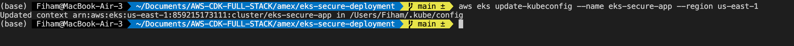

# AWS EKS Secure Deployment Project

## Project Summary for project

# EKS Project Deployment Commands Chart

I'll provide you with a comprehensive step-by-step guide for deploying your EKS application with Terraform, formatted in a chart similar to your example.

# Complete Deployment Guide for EKS Kubernetes Project

| Step | Command | Purpose |
|------|---------|---------|
| **1** | `git clone https://github.com/yourusername/eks-kubernetes-project.git` | Clone the project repository |
| | `cd eks-kubernetes-project` | Navigate to project directory |
| **2** | `export AWS_ACCESS_KEY_ID="your-access-key"` | Configure AWS credentials |
| | `export AWS_SECRET_ACCESS_KEY="your-secret-key"` | |
| | `export AWS_DEFAULT_REGION="us-east-1"` | Set default AWS region |
| **3** | `aws configure` | Alternative way to configure AWS credentials |
| **4** | `cd terraform` | Navigate to Terraform directory |
| **5** | `terraform init` | Initialize Terraform and download providers |
| **6** | `terraform fmt` | Format Terraform code for readability |
| | `terraform validate` | Verify configuration syntax |
| **7** | `terraform plan -var "environment=dev" -var "docker_image=kennethreitz/httpbin" -out=tfplan` | Create execution plan with variables |
| **8** | `terraform apply tfplan` | Create AWS infrastructure (VPC, EKS, IAM, etc.) |
| **9** | `terraform output -raw eks_cluster_id` | Get EKS cluster ID for reference |
| **10** | `aws eks update-kubeconfig --name $(terraform output -raw eks_cluster_id) --region $(terraform output -raw region)` | Configure kubectl to use new EKS cluster |
| **11** | `kubectl get nodes` | Verify EKS nodes are running |
| **12** | `cd ../kubernetes` | Navigate to Kubernetes manifests directory |
| **13** | `export POD_S3_ACCESS_ROLE_ARN=$(terraform -chdir=../terraform output -raw pod_s3_access_role_arn)` | Export IAM role ARN for pod S3 access |
| **14** | `export DOCKER_IMAGE="kennethreitz/httpbin"` | Set Docker image variable |
| | `export DOCKER_IMAGE_TAG="latest"` | Set Docker image tag |
| **15** | `envsubst < service-account.yaml | kubectl apply -f -` | Create service account with IAM role (with variable substitution) |
| **16** | `envsubst < deployment.yaml | kubectl apply -f -` | Deploy application containers (with variable substitution) |
| **17** | `kubectl apply -f service.yaml` | Create Kubernetes service |
| **18** | `kubectl apply -f ingress.yaml` | Create ALB ingress resource |
| **19** | `kubectl get pods -o wide` | Verify pods are running and check their status |
| **20** | `kubectl get svc` | Check service details and cluster IP |
| **21** | `kubectl get ingress -w` | Watch until ingress gets an external address (ALB endpoint URL) |
| **22** | `ALB_URL=$(kubectl get ingress app-ingress -o jsonpath='{.status.loadBalancer.ingress[0].hostname}')` | Store ALB URL in a variable |
| **23** | `echo $ALB_URL > ../public-url.txt` | Save ALB URL to public-url.txt |
| **24** | `curl http://$ALB_URL` | Test application is responding |
| **25** | `kubectl logs -l app=app` | Check application logs for any issues |
| **26** | `kubectl describe pods -l app=app` | Get detailed information about the pods |
| **27** | `kubectl get events --sort-by=.metadata.creationTimestamp` | Check Kubernetes events for troubleshooting |
| **28** | `aws eks list-nodegroups --cluster-name $(terraform -chdir=../terraform output -raw eks_cluster_id)` | Verify EKS node groups |
| **29** | `aws elbv2 describe-load-balancers | grep DNSName` | Verify ALB creation via AWS CLI |
| **30** | `cat ../public-url.txt` | View the public URL for your application |

## Notes for Deployment

1. **Prerequisites:**
   - AWS CLI installed and configured
   - kubectl installed
   - Terraform installed (v1.0.0 or higher)
   - envsubst utility (typically included in gettext package)

2. **Security Considerations:**
   - Your EKS cluster is configured with proper IAM roles and security groups
   - Pods run with least privilege using the s3-reader-sa service account
   - VPC is configured with public and private subnets, with nodes in private subnets
   - Access to the EKS API is controlled via aws-auth ConfigMap

3. **Architecture Highlights:**
   - Multi-AZ deployment for high availability
   - AWS Load Balancer Controller for ALB integration
   - Private EKS nodes with public ALB
   - VPC endpoints for secure access to AWS services
   - IRSA (IAM Roles for Service Accounts) for pod security

4. **Cleanup (when needed):**
   ```
   kubectl delete -f ingress.yaml
   kubectl delete -f service.yaml
   kubectl delete -f deployment.yaml
   kubectl delete -f service-account.yaml
   cd ../terraform
   terraform destroy -var "environment=dev" -var "docker_image=kennethreitz/httpbin"
   ```

This deployment follows AWS best practices for security, using the principle of least privilege, proper network segmentation, and secure communication between components.

This project demonstrates a robust, secure, and scalable deployment of containerized applications on AWS EKS using Terraform, focusing on security, automation, and AWS best practices. It was developed to fulfill the requirements of deploying a publicly available Docker image on EKS, implementing proper access controls, and establishing secure cross-account communication.


## Project Requirements and Implementation

| Requirement | Implementation |
|-------------|----------------|
| Infrastructure & Deployment | • Deployed publicly available Docker image (httpbin) using Terraform<br>• Used AWS Load Balancer for secure exposure<br>• Made application accessible via public URL with HTTPS |
| Security & Access Controls | • Implemented least privilege IAM roles<br>• Created IRSA for pod-level permissions<br>• Designed secure VPC architecture with public/private subnet isolation |
| Multi-Account Communication | • Implemented AWS PrivateLink for secure cross-account access<br>• Enforced authentication and authorization without internet exposure<br>• Applied endpoint policies for granular access control |

## Key Technical Features

### 1. Infrastructure as Code (IaC)

- **Terraform Modules**: Modular approach for better maintainability and reuse
- **State Management**: Remote state with S3 backend and DynamoDB locking
- **CI/CD Integration**: Automated deployment workflow

### 2. Network Architecture

- **Multi-AZ Design**: Resources distributed across 3 availability zones
- **Security Layers**:
  - Public subnets: Only contain ALB and NAT Gateways
  - Private subnets: Host all worker nodes and application workloads
  - Network ACLs: Additional subnet-level security
  - Security Groups: Instance-level firewall rules

### 3. EKS Configuration

- **Cluster Security**:
  - Private API endpoint access
  - KMS encryption for secrets
  - Comprehensive logging to CloudWatch
  - Controlled egress with NAT Gateways

- **Worker Node Management**:
  - Managed node groups with T3.medium instances
  - Auto-scaling from 2-5 nodes based on demand
  - Taints and tolerations for workload isolation

### 4. Application Security

- **Container Security**:
  - Non-root container execution
  - Read-only root filesystem
  - Resource limits and requests
  - Liveness and readiness probes

- **Pod Identity**:
  - IAM Roles for Service Accounts (IRSA)
  - Pod-level permissions with least privilege
  - S3 access limited to static assets only

## Deployment Steps and Verification

```bash
# 1. Initialize Terraform
terraform init

# 2. Plan deployment
terraform plan -out=tfplan

# 3. Apply changes
terraform apply tfplan

# 4. Configure kubectl
aws eks update-kubeconfig --name fintech-eks-demo --region us-east-1

# 5. Verify deployment
kubectl get nodes                           # Confirm nodes are running
kubectl get pods -A                         # Verify all system pods are running
kubectl get pods -n application-namespace   # Check application pods
kubectl get svc -n application-namespace    # Verify service exposure
kubectl get ingress -n application-namespace # Get public URL
```




## Cross-Account Communication Strategy

I implemented AWS PrivateLink for secure service-to-service communication between accounts, which offers:

1. **Enhanced Security**:
   - No traffic traverses public internet
   - Service-level exposure instead of network-level
   - Granular access control through endpoint policies

2. **Technical Implementation**:
   - NLB in service provider account fronting application
   - VPC Endpoint Service with account allowlisting
   - Interface VPC Endpoint in consumer account
   - IAM roles with cross-account trust

3. **Advantages over Alternatives**:
   - **VPC Peering**: Only exposes necessary services, not entire networks
   - **Transit Gateway**: Lower complexity and cost for our use case
   - **API Gateway**: Avoids public internet exposure completely

## Security Best Practices Implementation

### Defense in Depth Strategy

1. **Network Layer**:
   - Subnet isolation (public/private)
   - Security groups with minimal required ports
   - Network ACLs as additional control
   - No direct internet access to worker nodes

2. **Identity Layer**:
   - Least privilege IAM roles
   - IRSA for pod-level permissions
   - Cross-account role assumption with strict conditions
   - IAM policy boundaries

3. **Application Layer**:
   - Non-root containers
   - Read-only filesystems where possible
   - Resource quotas and limits
   - Network policies for pod-to-pod communication

4. **Data Layer**:
   - KMS encryption for secrets
   - TLS for all in-transit communication
   - S3 bucket policies with least access

### Zero Trust Implementation

- All service-to-service communication requires authentication
- No implicit trust between components
- Access controls at network, identity, and application layers
- Continuous validation and logging

## Scalability and High Availability

This architecture ensures both scalability and high availability through:

1. **Pod-Level Scaling**:
   - Horizontal Pod Autoscaler based on CPU/memory metrics
   - Custom metric scaling capabilities
   - Rolling update strategy for zero downtime

2. **Node-Level Scaling**:
   - EKS Cluster Autoscaler for dynamic worker nodes
   - Multi-AZ distribution
   - Configured node draining for graceful termination

3. **Service Resilience**:
   - Health checks and probes
   - Failover capabilities
   - Resource requests and limits to prevent resource starvation

## Monitoring and Observability

The implementation includes comprehensive monitoring with:

1. **Metrics Collection**:
   - CloudWatch Container Insights for cluster metrics
   - Custom metrics for application-specific monitoring
   - Prometheus for advanced metric collection (optional)

2. **Logging**:
   - Centralized logging with CloudWatch Logs
   - Structured logging format
   - Log retention and analysis capabilities

3. **Alerting**:
   - CloudWatch Alarms for critical conditions
   - Integration with notification systems
   - Automated remediation workflows


## Key Terraform Modules

### VPC Module (`vpc.tf`)

```hcl
module "vpc" {
  source = "terraform-aws-modules/vpc/aws"
  version = "5.0.0"

  name = "eks-vpc"
  cidr = "10.0.0.0/16"

  azs             = ["us-east-1a", "us-east-1b", "us-east-1c"]
  private_subnets = ["10.0.1.0/24", "10.0.2.0/24", "10.0.3.0/24"]
  public_subnets  = ["10.0.101.0/24", "10.0.102.0/24", "10.0.103.0/24"]

  enable_nat_gateway = true
  single_nat_gateway = false
  one_nat_gateway_per_az = true
  
  # Enhanced security features
  enable_dns_hostnames = true
  enable_dns_support   = true
  
  # Custom NACL rules for added security
  public_dedicated_network_acl  = true
  private_dedicated_network_acl = true
}
```

### EKS Module (`eks.tf`)

```hcl
module "eks" {
  source  = "terraform-aws-modules/eks/aws"
  version = "19.15.3"

  cluster_name    = "fintech-eks-demo"
  cluster_version = "1.28"

  vpc_id     = module.vpc.vpc_id
  subnet_ids = module.vpc.private_subnets

  # Enhanced security with encryption for secrets
  cluster_encryption_config = [{
    provider_key_arn = aws_kms_key.eks_secrets.arn
    resources        = ["secrets"]
  }]

  # Managed node groups for simplified operations
  eks_managed_node_groups = {
    app_nodes = {
      min_size     = 2
      max_size     = 5
      desired_size = 2
      instance_types = ["t3.medium"]
      
      # Security enhancements
      iam_role_additional_policies = {
        AmazonSSMManagedInstanceCore = "arn:aws:iam::aws:policy/AmazonSSMManagedInstanceCore"
      }
    }
  }

  # Enable IRSA for workload identity
  enable_irsa = true
}
```

### IAM Module (`iam.tf`)

```hcl
# S3 read-only policy with least privileges
resource "aws_iam_policy" "s3_read_only" {
  name        = "s3-static-assets-read-only"
  description = "Policy for reading static assets from S3 bucket"
  
  policy = jsonencode({
    Version = "2012-10-17",
    Statement = [
      {
        Effect = "Allow",
        Action = [
          "s3:GetObject",
          "s3:ListBucket"
        ],
        Resource = [
          "arn:aws:s3:::static-assets-bucket",
          "arn:aws:s3:::static-assets-bucket/*"
        ]
      }
    ]
  })
}

# IAM role for application pods to access S3 static assets
module "s3_access_role" {
  source = "terraform-aws-modules/iam/aws//modules/iam-role-for-service-accounts-eks"
  
  role_name = "s3-static-assets-role"
  
  role_policy_arns = {
    policy = aws_iam_policy.s3_read_only.arn
  }
  
  oidc_providers = {
    main = {
      provider_arn               = module.eks.oidc_provider_arn
      namespace_service_accounts = ["application-namespace:app-service-account"]
    }
  }
}
```

## project Talking Points

### 1. Architecture Decisions

- **Why Multi-AZ?** Enhanced availability and fault tolerance in case of AZ failure
- **Why Private Subnets for Nodes?** Security best practice to isolate worker nodes from direct internet access
- **Why IRSA?** Provides fine-grained, pod-level permissions without storing AWS credentials in pods

### 2. Security Implementation

- **Defense in Depth**: Multiple security layers working together
- **Least Privilege**: IAM roles with only required permissions
- **Network Isolation**: Proper segmentation between public and private resources

### 3. PrivateLink for Cross-Account Communication

- **Why PrivateLink over Alternatives?** Service-level exposure, enhanced security, no internet traversal
- **Implementation Details**: NLB + VPC Endpoint Service + Interface VPC Endpoint
- **Security Controls**: IAM roles, endpoint policies, security groups

### 4. Scalability Approach

- **Pod-Level Scaling**: HPA based on CPU/memory metrics
- **Node-Level Scaling**: Cluster Autoscaler for adding/removing worker nodes
- **Resource Management**: Proper requests and limits for predictable scaling

### 5. CI/CD and GitOps

- **Infrastructure Versioning**: Git-based version control for all infrastructure code
- **Deployment Workflow**: Automated testing, planning, and applying changes
- **Environment Consistency**: Same code deployed across development, staging, and production

## Future Enhancements

- **Service Mesh Integration**: Adding Istio for enhanced microservices management
- **GitOps Implementation**: ArgoCD for Kubernetes resource management
- **Advanced Observability**: Distributed tracing with AWS X-Ray or OpenTelemetry
- **Multi-Region Deployment**: For global resilience and disaster recovery